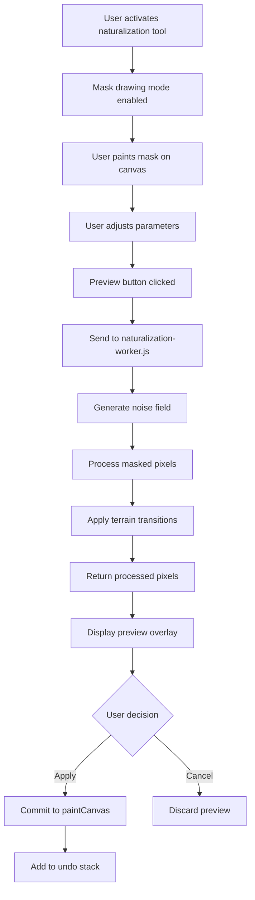

# Design Document: Map Naturalization

## Overview

The Map Naturalization feature transforms sharp, artificial terrain boundaries into organic, realistic transitions using mathematical noise functions. Users paint a mask over regions they want to enhance, and the system applies fractal algorithms to create jagged coastlines, gradual elevation changes, and scattered islands.

This feature integrates into the existing Paint Modal as a new tool alongside the terrain brushes. The implementation leverages Web Workers for performance, following the established pattern of offloading pixel processing from the main thread.

### Key Design Decisions

1. **Perlin noise library**: Use a lightweight, tested implementation rather than building from scratch
2. **Worker-based processing**: Follow the existing `worker.js` pattern for consistency and performance
3. **Mask-based selection**: Reuse the canvas overlay pattern from the paint system
4. **Progressive enhancement**: Build on existing paint infrastructure rather than creating parallel systems

## Architecture

### Component Structure

```
paint.js (existing)
├── Terrain paint tools (existing)
├── Brush system (existing)
└── Naturalization tool (new)
    ├── Mask drawing mode
    ├── Parameter controls
    └── Preview/Apply workflow

naturalization-worker.js (new)
├── Perlin noise implementation
├── Terrain transition logic
├── Island generation
└── Highland insertion

app.js (minimal changes)
└── Worker message routing (if needed)
```

### Data Flow



## Components and Interfaces

### 1. Naturalization Tool UI (paint.js extension)

**Location**: Integrated into existing Paint Modal

**UI Elements**:
- Naturalization button in toolbar (after terrain buttons)
- Parameter panel (collapsible):
  - Transition width slider (2-50px, default 10)
  - Noise frequency slider (0.01-0.1, default 0.05)
  - Island density slider (0.0-1.0, default 0.3)
- Preview/Apply/Cancel buttons
- Mask canvas overlay (semi-transparent red tint)

**State Variables**:
```javascript
let naturalizationActive = false;
let maskCanvas = null; // Separate canvas for mask
let previewCanvas = null; // Temporary preview result
let naturalizationParams = {
  transitionWidth: 10,
  noiseFrequency: 0.05,
  islandDensity: 0.3
};
```

### 2. Mask Drawing System

**Implementation**: Extend existing paint brush system

**Mask Canvas**:
- Same dimensions as paintCanvas
- Stores mask as grayscale (0-255)
- Rendered as semi-transparent red overlay during drawing
- Cleared after apply/cancel

**Drawing Behavior**:
- Uses existing brush size slider
- Always draws white (255) on mask
- No terrain color selection needed
- Supports undo/redo through existing system

### 3. Naturalization Worker

**File**: `naturalization-worker.js` (new)

**Message Interface**:
```javascript
// Input message
{
  type: 'naturalize',
  imageData: Uint8ClampedArray,  // Current terrain pixels
  maskData: Uint8Array,           // Mask values (0-255)
  width: number,
  height: number,
  params: {
    transitionWidth: number,
    noiseFrequency: number,
    islandDensity: number,
    waterThreshold: number  // From main app state
  }
}

// Output message
{
  type: 'naturalize-result',
  imageData: Uint8ClampedArray,  // Processed pixels
  width: number,
  height: number
}
```

### 4. Perlin Noise Implementation

**Library Choice**: Implement a minimal 2D Perlin noise function (< 100 lines)

**Rationale**: 
- No suitable CDN library for Web Workers (no module imports in workers)
- Perlin noise is well-documented and straightforward to implement
- Full control over performance characteristics

**Interface**:
```javascript
class PerlinNoise {
  constructor(seed) {
    // Initialize permutation table with seed
  }
  
  noise2D(x, y) {
    // Returns value in range [-1, 1]
  }
}
```

**Reference Implementation**: Based on Ken Perlin's improved noise (2002)

## Data Models

### Terrain Zone Encoding

Reuse existing color-to-zone mapping from `worker.js`:

```javascript
const TERRAIN_COLORS = {
  water:    [18,  15,  34],   // Zone 0
  plain:    [140, 170, 88],   // Zone 1
  highland: [176, 159, 114],  // Zone 2
  mountain: [190, 190, 190]   // Zone 3
};
```

### Mask Data Structure

```javascript
// Uint8Array, one byte per pixel
// 0 = no naturalization
// 255 = full naturalization
// 1-254 = blend between original and naturalized
```

### Noise Field

```javascript
// Float32Array, one float per pixel
// Cached for the duration of preview/apply
// Values in range [-1, 1]
```

## Correctness Properties

*A property is a characteristic or behavior that should hold true across all valid executions of a system—essentially, a formal statement about what the system should do. Properties serve as the bridge between human-readable specifications and machine-verifiable correctness guarantees.*

### Property 1: Mask Drawing Opacity

*For any* brush stroke on the mask canvas, all pixels touched by the stroke should be recorded with full opacity (255) in the underlying mask data array.

**Validates: Requirements 2.3**

### Property 2: Brush Size Range

*For any* brush size value set by the user, if the value is within the range [1, 120], the brush should accept and use that size for drawing operations.

**Validates: Requirements 2.4**

### Property 3: Terrain Boundary Detection

*For any* masked region containing pixels of different terrain zones, the naturalization algorithm should identify all adjacent pixel pairs where terrain zones differ.

**Validates: Requirements 3.1**

### Property 4: Noise-Based Transition Probabilities

*For any* pair of adjacent pixels with different terrain zones within the masked region, the naturalization algorithm should calculate a transition probability using the noise function output at those coordinates.

**Validates: Requirements 3.2**

### Property 5: Highland Insertion Between Mountain and Plain

*For any* Mountain-Plain boundary within the masked region, Highland pixels should be inserted with probability P = noise(x, y) * (1 - distance_from_mountain / transition_width), and when P > 0.5, the pixel should become Highland terrain.

**Validates: Requirements 3.3, 5.3, 5.4, 5.5**

### Property 6: Fractal Coastline Generation

*For any* Plain-Water boundary within the masked region, the naturalization algorithm should apply the noise function to create non-linear, jagged boundaries rather than preserving straight edges.

**Validates: Requirements 3.4**

### Property 7: Noise Frequency Bounds

*For any* naturalization operation, the noise function frequency parameter should be within the range [0.01, 0.1] per pixel.

**Validates: Requirements 3.5**

### Property 8: Transition Width Configuration

*For any* transition width value set by the user, if the value is within the range [2, 50] pixels, the naturalization algorithm should use that width when calculating transition zones.

**Validates: Requirements 3.6**

### Property 9: Island Generation from Noise

*For any* Water zone adjacent to land within the masked region, the naturalization algorithm should generate island candidates by thresholding the noise function output.

**Validates: Requirements 4.1**

### Property 10: Island Size Filtering

*For any* island candidate generated by noise thresholding, if its area is between 5 and 200 pixels (inclusive), it should be added to the map; otherwise, it should be discarded.

**Validates: Requirements 4.2**

### Property 11: Consistent Noise Function Usage

*For any* naturalization operation, the same noise function instance (with the same seed and parameters) should be used for both terrain transitions and island generation.

**Validates: Requirements 4.3**

### Property 12: Island Terrain Type from Noise Amplitude

*For any* generated island, its terrain type (Plain or Highland) should be determined by the noise amplitude at its location, with higher amplitudes producing Highland terrain.

**Validates: Requirements 4.4**

### Property 13: Island Density Configuration

*For any* island density value set by the user, if the value is within the range [0.0, 1.0], the naturalization algorithm should use that density when thresholding noise for island generation, with 0.0 producing no islands and 1.0 producing maximum islands.

**Validates: Requirements 4.5**

### Property 14: Parameter Persistence

*For any* naturalization parameter values set by the user, after storing them in local storage and reloading the page, the retrieved parameter values should match the originally stored values.

**Validates: Requirements 6.5**

### Property 15: Cancel Restores Original State

*For any* map state before naturalization preview, after generating a preview and clicking cancel, the map canvas should be restored to the exact state it was in before the preview was generated.

**Validates: Requirements 7.4**

### Property 16: Undo Restores Pre-Naturalization State

*For any* map state before applying naturalization, after applying naturalization and pressing Ctrl+Z, the map canvas should be restored to the exact state it was in before naturalization was applied.

**Validates: Requirements 8.2**

### Property 17: Undo Stack FIFO Behavior

*For any* sequence of more than 30 operations, when the undo stack is full and a new operation is added, the oldest operation should be removed from the stack before the new one is added.

**Validates: Requirements 8.4**

### Property 18: Unmasked Pixels Unchanged

*For any* pixel where the mask value is 0, after naturalization is applied, that pixel's terrain value should remain identical to its value before naturalization.

**Validates: Requirements 10.1**

### Property 19: Fully Masked Pixels Processed

*For any* pixel where the mask value is 255, after naturalization is applied, that pixel's terrain value should be the result of the naturalization algorithm (not the original value).

**Validates: Requirements 10.2**

### Property 20: Partial Mask Blending

*For any* pixel where the mask value M is between 1 and 254 (inclusive), after naturalization is applied, the resulting pixel color should be: result = original * (1 - M/255) + naturalized * (M/255).

**Validates: Requirements 10.3, 10.4**

### Property 21: Noise Function Output Range

*For any* input coordinates (x, y) and frequency f passed to the noise function, the returned value should be within the range [-1.0, 1.0].

**Validates: Requirements 11.3**

### Property 22: Noise Function Determinism

*For any* identical input coordinates (x, y) and frequency f passed to the noise function multiple times, the function should return the exact same output value each time.

**Validates: Requirements 11.4**


## Error Handling

### Input Validation

**Invalid Parameters**:
- Transition width < 2 or > 50: Clamp to valid range, show warning toast
- Noise frequency < 0.01 or > 0.1: Clamp to valid range
- Island density < 0.0 or > 1.0: Clamp to valid range
- Empty mask (all zeros): Disable preview/apply buttons, show "Draw a mask first" message

**Canvas State Errors**:
- paintCanvas not initialized: Gracefully fail, log error, show user message
- Dimension mismatch between paintCanvas and maskCanvas: Reinitialize maskCanvas
- Out of memory during processing: Catch error, show "Map too large" message, suggest smaller mask region

### Worker Communication Errors

**Worker Failures**:
- Worker script fails to load: Fall back to main thread processing (slower), log warning
- Worker crashes during processing: Catch error, show "Processing failed" message, allow retry
- Timeout (> 10 seconds): Terminate worker, show timeout message, suggest smaller region

**Message Handling**:
- Invalid message format: Log error, ignore message
- Missing required fields: Log error, show "Internal error" message
- Transferable object transfer fails: Fall back to copying data (slower)

### User Experience

**Progress Feedback**:
- Processing > 500ms: Show spinner with "Naturalizing terrain..." message
- Processing > 3s: Add progress percentage if possible
- Processing > 10s: Show "This is taking longer than expected" with cancel option

**Graceful Degradation**:
- If Web Workers unavailable: Process on main thread with warning
- If local storage unavailable: Parameters reset each session, show notice
- If canvas operations fail: Disable naturalization tool, show error message

## Testing Strategy

### Unit Testing

**Noise Function Tests**:
- Test output range: Verify all outputs are in [-1, 1]
- Test determinism: Same inputs produce same outputs
- Test smoothness: Adjacent coordinates produce similar values (gradient test)
- Test frequency parameter: Higher frequency produces more variation

**Terrain Detection Tests**:
- Test boundary identification: Create known terrain patterns, verify boundaries found
- Test zone classification: Verify pixels correctly classified as water/plain/highland/mountain
- Test edge cases: Single-pixel regions, checkerboard patterns, all-same-terrain

**Blending Tests**:
- Test mask value 0: Original pixel unchanged
- Test mask value 255: Fully naturalized pixel
- Test mask value 127: 50/50 blend
- Test blending formula: Verify exact formula implementation

**Island Generation Tests**:
- Test size filtering: Islands < 5 pixels rejected, islands > 200 pixels rejected
- Test density parameter: density=0 produces no islands, density=1 produces maximum
- Test terrain assignment: Verify Plain/Highland assignment based on noise amplitude

### Property-Based Testing

**Configuration**: Use fast-check library (JavaScript), minimum 100 iterations per test

**Property Test 1: Unmasked Preservation**
```javascript
// Feature: map-naturalization, Property 18: For any pixel where mask=0, terrain unchanged
fc.assert(
  fc.property(
    fc.array(fc.integer(0, 3), { minLength: 100, maxLength: 10000 }), // terrain zones
    fc.array(fc.integer(0, 255), { minLength: 100, maxLength: 10000 }), // mask values
    (terrain, mask) => {
      const result = naturalize(terrain, mask, params);
      for (let i = 0; i < terrain.length; i++) {
        if (mask[i] === 0) {
          expect(result[i]).toBe(terrain[i]);
        }
      }
    }
  ),
  { numRuns: 100 }
);
```

**Property Test 2: Noise Determinism**
```javascript
// Feature: map-naturalization, Property 22: Identical inputs produce identical outputs
fc.assert(
  fc.property(
    fc.float({ min: 0, max: 1000 }), // x coordinate
    fc.float({ min: 0, max: 1000 }), // y coordinate
    fc.float({ min: 0.01, max: 0.1 }), // frequency
    (x, y, freq) => {
      const noise = new PerlinNoise(12345);
      const result1 = noise.noise2D(x * freq, y * freq);
      const result2 = noise.noise2D(x * freq, y * freq);
      expect(result1).toBe(result2);
    }
  ),
  { numRuns: 100 }
);
```

**Property Test 3: Noise Output Range**
```javascript
// Feature: map-naturalization, Property 21: Noise output in [-1, 1]
fc.assert(
  fc.property(
    fc.float({ min: -1000, max: 1000 }), // x
    fc.float({ min: -1000, max: 1000 }), // y
    fc.float({ min: 0.01, max: 0.1 }), // frequency
    (x, y, freq) => {
      const noise = new PerlinNoise(12345);
      const result = noise.noise2D(x * freq, y * freq);
      expect(result).toBeGreaterThanOrEqual(-1.0);
      expect(result).toBeLessThanOrEqual(1.0);
    }
  ),
  { numRuns: 100 }
);
```

**Property Test 4: Blending Formula**
```javascript
// Feature: map-naturalization, Property 20: Partial mask blending formula
fc.assert(
  fc.property(
    fc.integer(0, 255), // original color component
    fc.integer(0, 255), // naturalized color component
    fc.integer(1, 254), // mask value (partial)
    (orig, nat, mask) => {
      const expected = Math.round(orig * (1 - mask/255) + nat * (mask/255));
      const result = blend(orig, nat, mask);
      expect(result).toBe(expected);
    }
  ),
  { numRuns: 100 }
);
```

**Property Test 5: Island Size Filtering**
```javascript
// Feature: map-naturalization, Property 10: Islands filtered by size
fc.assert(
  fc.property(
    fc.array(fc.boolean(), { minLength: 100, maxLength: 10000 }), // noise threshold results
    (noiseMap) => {
      const islands = detectIslands(noiseMap, width, height);
      for (const island of islands) {
        expect(island.size).toBeGreaterThanOrEqual(5);
        expect(island.size).toBeLessThanOrEqual(200);
      }
    }
  ),
  { numRuns: 100 }
);
```

**Property Test 6: Highland Insertion Probability**
```javascript
// Feature: map-naturalization, Property 5: Highland insertion follows probability formula
fc.assert(
  fc.property(
    fc.float({ min: -1, max: 1 }), // noise value
    fc.integer(0, 50), // distance from mountain
    fc.integer(2, 50), // transition width
    (noiseVal, dist, width) => {
      const prob = noiseVal * (1 - dist / width);
      const shouldBeHighland = prob > 0.5;
      const result = calculateTerrainTransition(noiseVal, dist, width, 'mountain', 'plain');
      if (shouldBeHighland) {
        expect(result).toBe('highland');
      }
    }
  ),
  { numRuns: 100 }
);
```

**Property Test 7: Parameter Persistence Round-Trip**
```javascript
// Feature: map-naturalization, Property 14: Parameters persist across sessions
fc.assert(
  fc.property(
    fc.integer(2, 50), // transition width
    fc.float({ min: 0.01, max: 0.1 }), // noise frequency
    fc.float({ min: 0.0, max: 1.0 }), // island density
    (width, freq, density) => {
      const params = { transitionWidth: width, noiseFrequency: freq, islandDensity: density };
      saveParams(params);
      const loaded = loadParams();
      expect(loaded.transitionWidth).toBe(width);
      expect(loaded.noiseFrequency).toBeCloseTo(freq, 5);
      expect(loaded.islandDensity).toBeCloseTo(density, 5);
    }
  ),
  { numRuns: 100 }
);
```

### Integration Testing

**Paint Modal Integration**:
- Test tool activation: Verify naturalization button appears and activates correctly
- Test tool switching: Activate naturalization, switch to terrain brush, verify deactivation
- Test undo integration: Apply naturalization, undo, verify state restored
- Test canvas coordination: Verify mask canvas and paint canvas stay synchronized

**Worker Integration**:
- Test message passing: Send naturalization request, verify response received
- Test transferable objects: Verify data transferred without copying
- Test error handling: Simulate worker crash, verify graceful recovery
- Test timeout handling: Simulate long processing, verify timeout triggers

**UI Integration**:
- Test parameter sliders: Adjust each slider, verify preview updates
- Test preview workflow: Generate preview, verify overlay displayed correctly
- Test apply workflow: Apply naturalization, verify changes committed
- Test cancel workflow: Cancel preview, verify original state restored

### Performance Testing

**Benchmarks** (not property tests, but important to track):
- Small region (< 10,000 pixels): Should complete in < 100ms
- Medium region (10,000 - 100,000 pixels): Should complete in < 1s
- Large region (100,000 - 500,000 pixels): Should complete in < 3s
- Memory usage: Should not exceed 100MB for largest supported maps

**Stress Tests**:
- Maximum mask size (1024x1024 fully masked): Verify completion without crash
- Rapid parameter changes: Adjust sliders quickly, verify no race conditions
- Multiple undo/redo cycles: Perform 50+ operations, verify stack integrity
- Long session: Keep modal open for 30 minutes, verify no memory leaks

